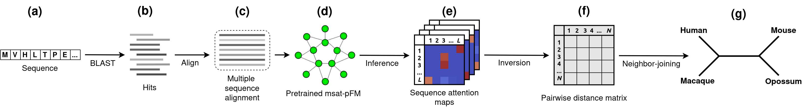
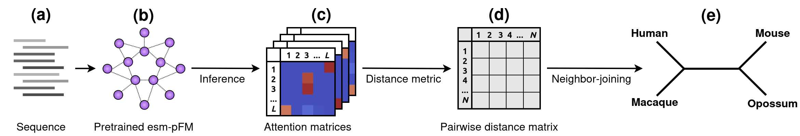

# PLM-Phylo
This is a repository for the scripts used in the paper "Multiple versus pairwise sequence alignments for protein phylogenetics using deep learning models", submitted to ISMB 2026 as a conference proceeding. This paper introduced two methods for inferring phylogenetic trees from the attention matrices of protein foundation models, specifically, MSA Transformer and ESM-2.

### MSA Transformer sequence attention matrix phylogenetic inference

### ESM-2 residue attention matrix phylogenetic inference

